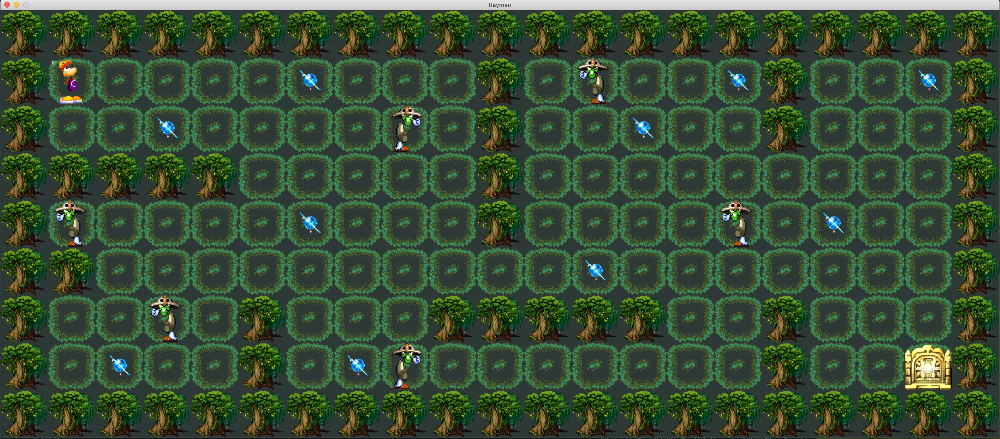

# SO-LONG

So long est un projet graphique qui permet d'acquérir des bases dans les compétences
suivantes : gestion de fenêtre, gestion des événements, des couleurs, des textures etc..

Fonctions autorisées : 

• open, close, read, write, printf, malloc, free, perror, strerror, exit

• Toutes les fonctions de la MiniLibX

## Lancer le programme

```./so-long maps/map_one.ber ```

